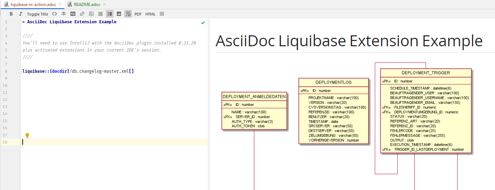

= Show case for Asciidoctor Liquibase Extension in IntelliJ

== About

This is a showcase how the https://github.com/uniqueck/asciidoctorj-liquibase-extension[AsciidoctorJ Liquibase Extension] can work with a live preview in the IntelliJ IDE using the https://intellij-asciidoc-plugin.ahus1.de/[IntelliJ AsciiDoc Plugin].
See below for a <<screenshot,screenshot>>.

== Setup

. Install IntelliJ 2020.2+
. Install AsciiDoc plugin for IntelliJ 0.31.20+
. Open `liquibase-in-action.adoc`
. Look for the notification `This project contains Asciidoctor Extensions in .asciidoctor/lib that can be executed to render the preview`
. Confirm it by clicking on `I've checked the code and trust it, enable them!`

Enjoy!

== Documentation

To find out more about this feature, visit the https://intellij-asciidoc-plugin.ahus1.de/docs/users-guide/features/advanced/asciidoctor-extensions.html[IntelliJ's extensions guide].

[#screenshot]
== Screenshot

== Author

[%hardbreaks]
Alexander Schwartz <alexander.schwartz@gmx.net>
Licensed: https://creativecommons.org/licenses/by-nc-sa/4.0/[CC BY NC SA 4.0]

Example content from https://github.com/uniqueck/asciidoctorj-liquibase-extension[AsciidoctorJ Liquibase Extension] (MIT licensed).
